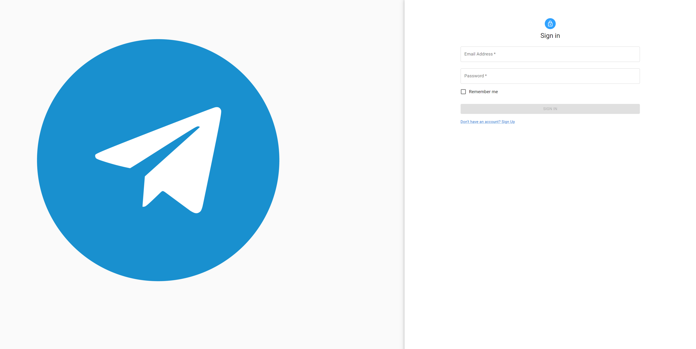
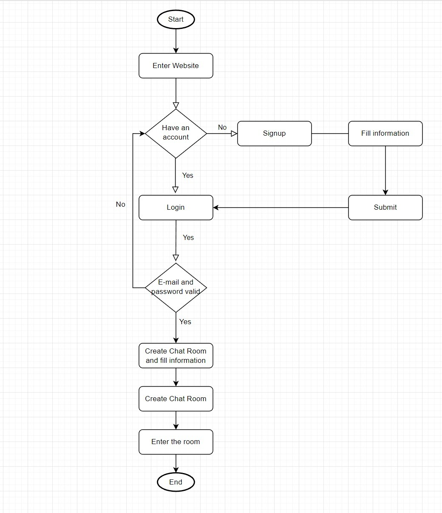
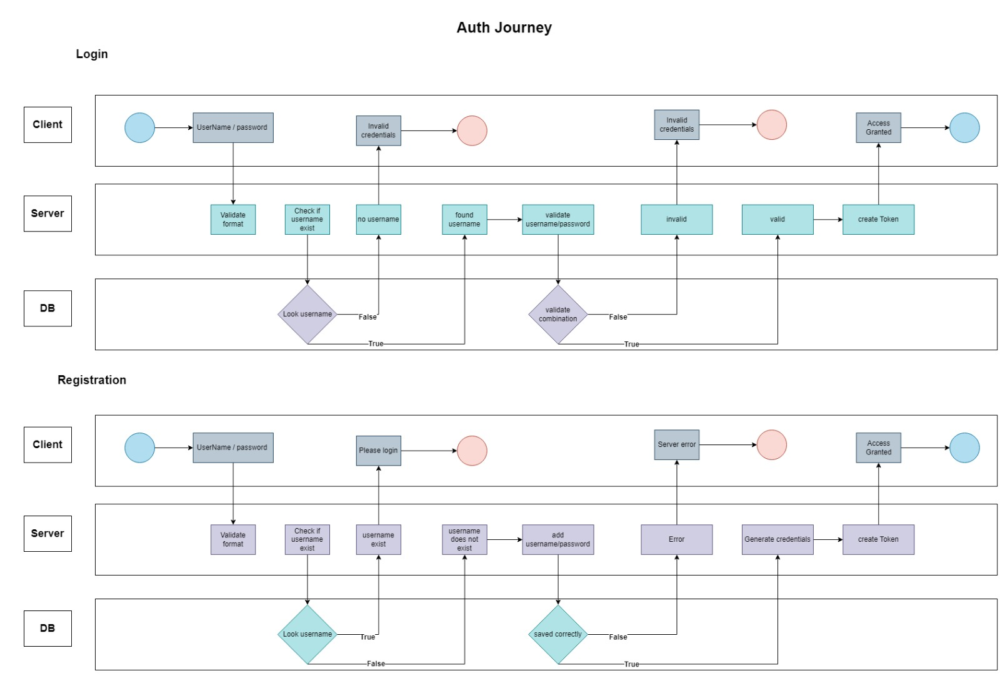

# Chat Application

This repository contains the project report for the Chat Application developed by using the MERN stack. The application is designed to facilitate real-time communication between users through chat messages.

## Overview

The Chat Application is developed using Node.js, Express, MongoDB, React.js, Socket.io, and JWT. The application's primary goal is to provide a platform for users to communicate with each other in real-time through chat messages. The application includes various features such as creating user accounts, joining chat rooms, sending and receiving messages, and logging out.

The application's front-end is developed using React.js, which is a popular JavaScript library for building user interfaces. The back-end is developed using Node.js and Express, which are popular JavaScript frameworks used for web development. MongoDB is used for the database management system, and Socket.io is used for real-time communication between users. JWT is used for user authentication and authorization.

## Goals

Our development goals for the Chat Application were as follows:

- Facilitate real-time communication between users through chat messages.
- Provide a platform for users to create accounts, join chat rooms, send and receive messages, and log out.
- Ensure secure communication by implementing user authentication and authorization using JWT.
- Develop a scalable and maintainable application using the MERN stack.
- Provide a user-friendly interface that is easy to navigate and use.

We are happy to report that we have achieved all of these goals.

## Features

- User account creation
- Chat room joining
- Sending and receiving messages
- Logging out

## Main Technologies Used

The Chat Application was built using the following technologies:

- MongoDB
- Express.js
- React
- Node.js
- JSON Web Tokens (JWT)

## Team members

| Name                        | Github                                                          |    ID     |
| --------------------------- | --------------------------------------------------------------- | :-------: |
| Turki Mohammed Alqahtani    | [Turkialq](https://github.com/Turkialq)                         | 440016263 |
| Faisal Mansour Alkhalifah   | [Faisalkh90](https://github.com/Faisalkh90)                     | 440025849 |
| Abdullah Mohammed Alqahtani | [AbdullahAlqahtani285](https://github.com/AbdullahAlqahtani285) | 440018317 |
| Abdullah Mohammed Alrasheed | [amhalrasheed](https://github.com/amhalrasheed)                 | 439027348 |

## User Interaction Flowchart

The following flowchart represents the complete user journey through using the Chat Application:

It shows the various steps involved in using the application, including creating an account, logging in, joining a chat room, sending and receiving messages, and logging out.

## Authentication Journey

The following journy chart represents the authentication Journey (JWT) implementation.

It displays the strategies we use for both login and registration.

## Getting Started

To get started with the Chat Application, follow these steps:

1. Clone the repository to your local machine.
2. Install the necessary dependencies by running `npm install` in both the client and server directories.
3. Create a `.env` file in the server directory and add your MongoDB connection string and JWT secret key. For example:
   `MONGODB_URI=<your-mongodb-connection-string>
JWT_SECRET=<your-jwt-secret-key>`
4. Start the server by running `npm run dev` in the server directory.
5. Start the client by running `npm run dev` in the client directory.
6. Open your web browser and navigate to `http://localhost:3000` to use the application.

## Conclusion

In conclusion, the application is developed using the MERN stack, which is a popular technology stack for web development. The user interaction flowchart provides a clear understanding of the user journey through the application. Overall, the application has the potential to provide a seamless and efficient communication experience to its users.
